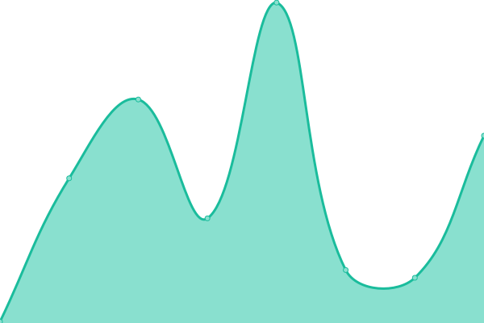

# [📈 Live Status](https://status.gggedr.xyz): <!--live status--> **🟩 All systems operational**

This repository contains the open-source uptime monitor and status page for [Vladimír Urík](https://status.gggedr.xyz), powered by [Upptime](https://github.com/upptime/upptime).

With [Upptime](https://upptime.js.org), you can get your own unlimited and free uptime monitor and status page, powered entirely by a GitHub repository. We use [Issues](https://github.com/Vladimir-Urik/status/issues) as incident reports, [Actions](https://github.com/Vladimir-Urik/status/actions) as uptime monitors, and [Pages](https://status.gggedr.xyz) for the status page.

<!--start: status pages-->
<!-- This summary is generated by Upptime (https://github.com/upptime/upptime) -->
<!-- Do not edit this manually, your changes will be overwritten -->
<!-- prettier-ignore -->
| URL | Status | History | Response Time | Uptime |
| --- | ------ | ------- | ------------- | ------ |
|  [Alexa Render API](https://api-alexa.pvpcraft.cz/) | 🟩 Up | [alexa-render-api.yml](https://github.com/Vladimir-Urik/status/commits/HEAD/history/alexa-render-api.yml) | 

 658ms
     
 | 

<a href="https://Vladimir-Urik.github.io/status/history/alexa-render-api">100.00%</a>
    

|  [Zadanie](https://zadanie-urik.vercel.app/) | 🟩 Up | [zadanie.yml](https://github.com/Vladimir-Urik/status/commits/HEAD/history/zadanie.yml) | 

 112ms
     
 | 

<a href="https://Vladimir-Urik.github.io/status/history/zadanie">100.00%</a>
    

<!--end: status pages-->

[**Visit our status website →**](https://status.gggedr.xyz)

## 📄 License

- Powered by: [Upptime](https://github.com/upptime/upptime)
- Code: [MIT](./LICENSE) © [Vladimír Urík](https://status.gggedr.xyz)
- Data in the `./history` directory: [Open Database License](https://opendatacommons.org/licenses/odbl/1-0/)
